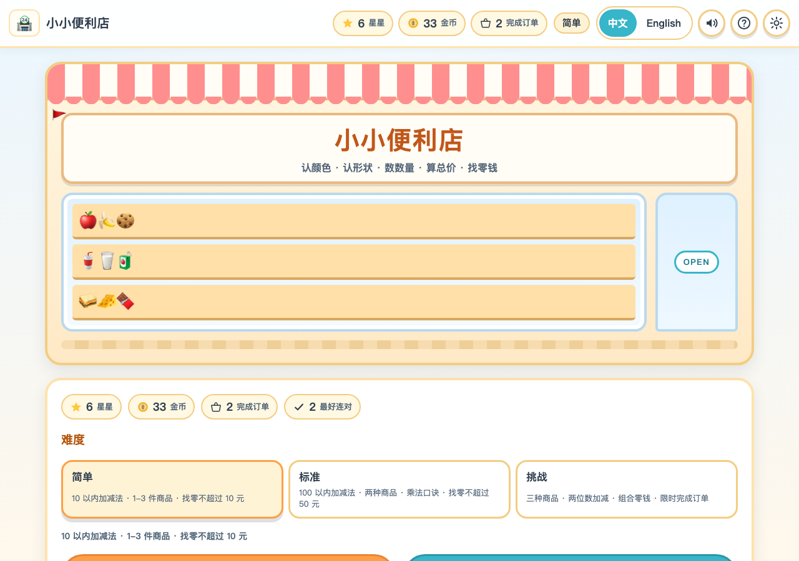
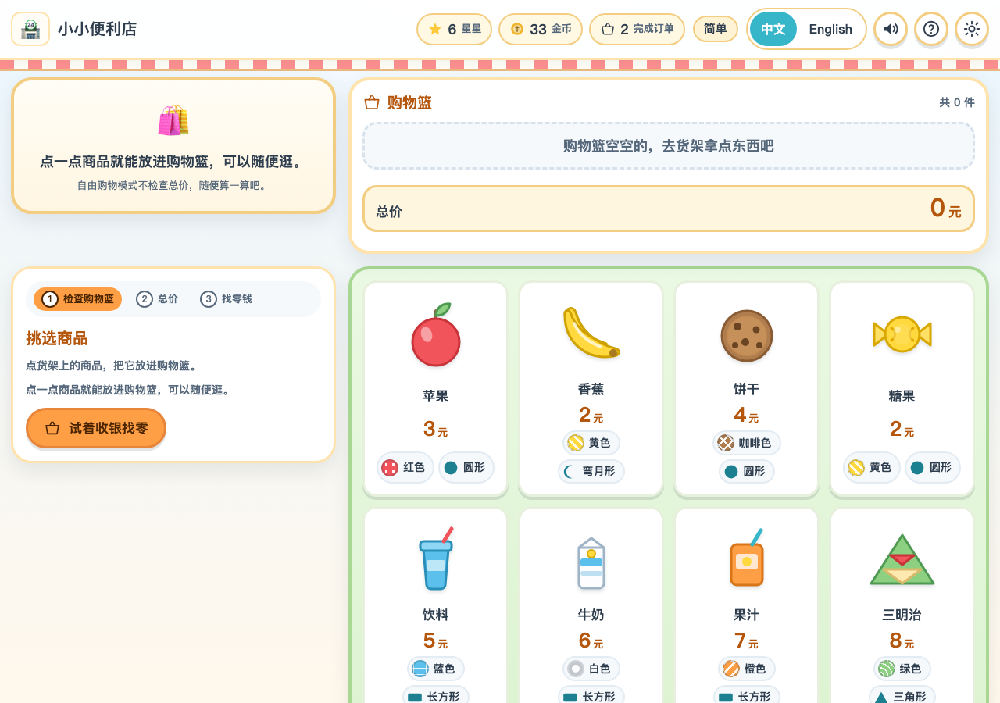
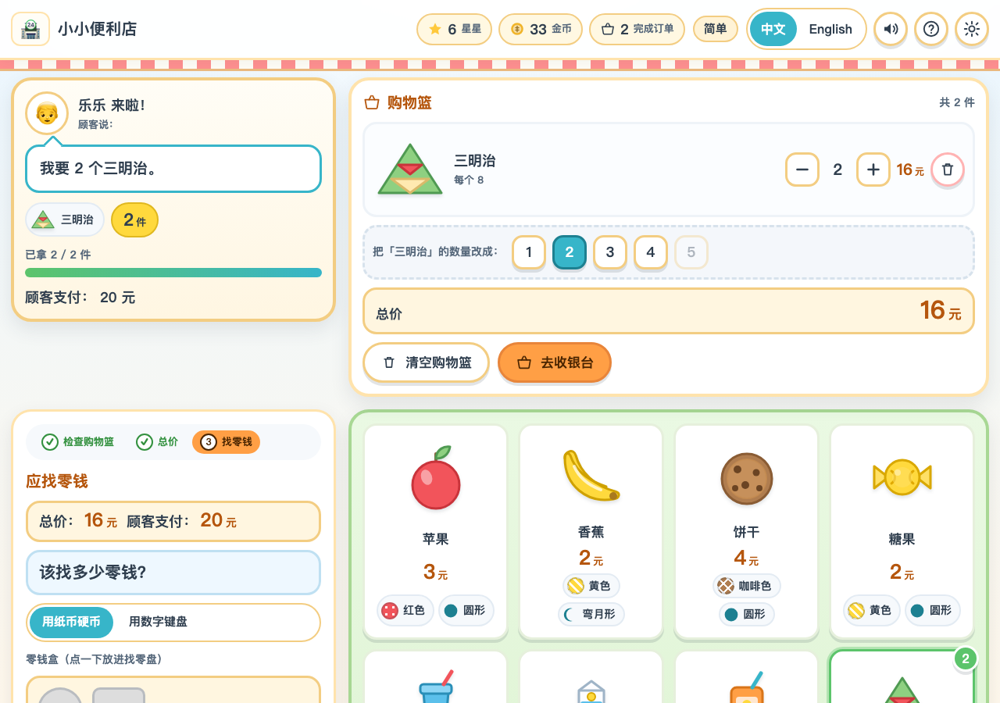
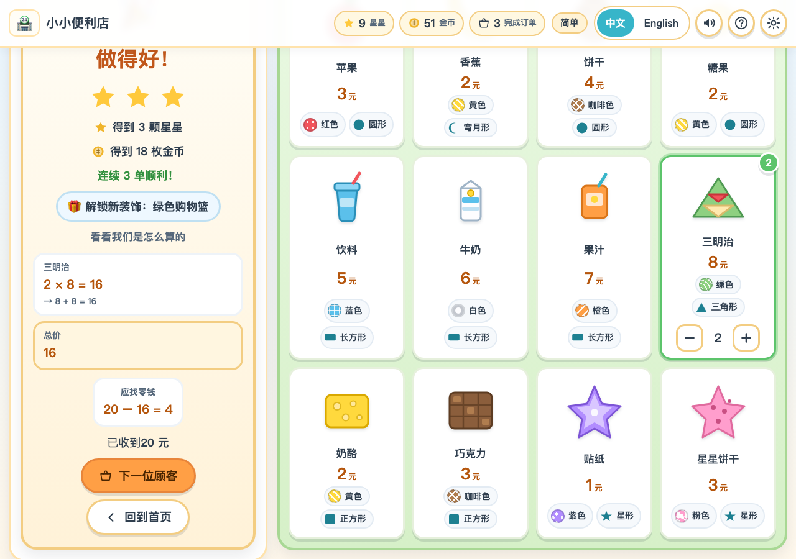
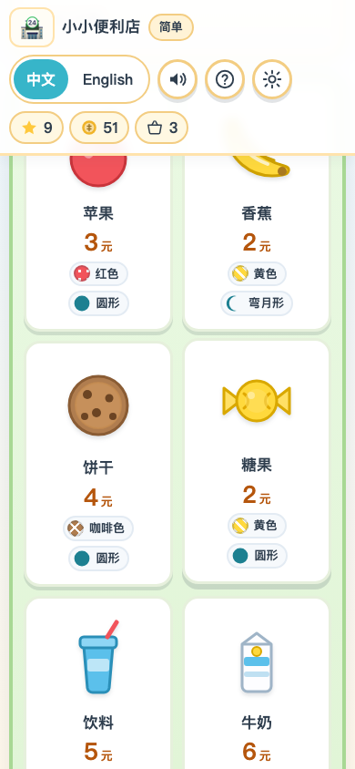
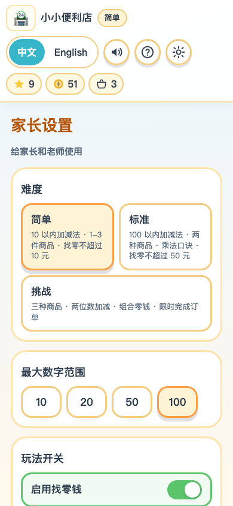

# 小小便利店 · Little Convenience Store

[](https://github.com/Hydrogx/little-convenience-store/actions/workflows/test.yml)
[](https://hydrogx.github.io/little-convenience-store/)

面向 **5-8 岁儿童** 的可爱风格网页模拟经营 + 数学启蒙游戏。
孩子扮演小小便利店店长：按顾客要求挑商品、算总价、收钱、找零钱，在经营过程中练习颜色、形状、数量、加法、减法、乘法和中英文词汇。

- 打开网页即可玩，核心玩法不依赖后端
- 同时支持电脑鼠标/键盘和手机触摸
- 中文 / English 实时切换，切换时不会丢失购物篮和进度
- 所有数据只保存在浏览器本地，不联网、不注册、无广告、无真实支付

---

## 🎮 在线试玩

> ## <https://hydrogx.github.io/little-convenience-store/>
>
> 纯静态、零依赖，点开即玩；手机浏览器也能直接打开。
> 每次 `git push` 到 `main`，GitHub Pages 会自动重新发布，不需要任何构建步骤。

---



| 便利店主场景 | 收银台 · 找零钱 |
|---|---|
|  |  |

| 答对后的计算过程 | 手机竖屏 | 家长设置 |
|---|---|---|
|  |  |  |

---

## 1. 启动命令与访问地址

零依赖，只需要 Node.js 18+（实测 Node 24）。

```bash
# 在项目目录下
npm start              # 等价于 node server.mjs
# 或者
node server.mjs --port 5173

# 没有 Node 也可以用 Python
python3 -m http.server 5173
```

启动后访问：

> **http://127.0.0.1:5173/**

只是想让别人试玩的话，不必启动本地服务器，直接用在线版：
**<https://hydrogx.github.io/little-convenience-store/>**（部署方式见第 9 节）

服务器只做一件事：把工作区里的静态文件按正确的 MIME 类型发出去（`server.mjs`，零依赖）。
之所以需要一个本地服务器：本项目按要求**把资源分开载入**（多个 CSS、30 多个 ES 模块、每种商品一个 SVG），
浏览器用 `file://` 直接打开时会因为 CORS 拒绝加载 ES 模块。真遇到这种情况，页面会显示一段友好的提示，
告诉你要运行哪条命令（实现见 `scripts/boot-check.js`）。

---

## 2. 资源分开载入（不是单页堆一起）

```
index.html                  页面骨架：分别引用 4 个 CSS、2 个脚本、1 个图标
styles/
  base.css                  设计变量、按钮、纸币硬币、对话框、动画
  home.css                  首页便利店门面 + 玩法卡片 + 家长设置
  game.css                  货架、商品卡片、购物篮、收银台、结果页
  responsive.css            手机竖屏/横屏、平板、笔记本、宽屏的断点
src/
  main.js                   入口：接线（语言、音效、键盘、渲染循环）
  state.js                  全局状态 + localStorage 存档
  game.js                   游戏控制器（所有状态变化都在这里）
  audio.js                  Web Audio 现场合成的 8 种音效（不加载音频文件）
  data/                     纯数据：商品、颜色、形状、面额、顾客、装饰、难度、玩法
  logic/                    纯函数：购物篮与总价、钱与找零、题目生成、奖励、随机数
  i18n/                     中英文两套字典（zh.js / en.js）+ 句子拼装 + 切换
  ui/                       界面零件与四个界面（首页 / 主场景 / 帮助 / 家长设置）
assets/
  products/*.svg            12 种商品各自一个 SVG，用  单独加载（可缓存、可并行）
  favicon.svg
scripts/boot-check.js       独立小脚本：缺少本地服务器时给出提示
tests/                      7 个测试文件（node:test）
tools/browser-check.mjs     用 Chrome DevTools Protocol 跑真实浏览器验收
```

每种商品的插画是独立的 SVG 文件，商品数据、颜色、形状、语言文本都在各自的数据模块里，
新增商品只需要「加一条数据 + 放一个 SVG」。

---

## 3. 已实现功能（对照 PRD）

### 3.1 MVP 清单（PRD 16）

| # | 功能 | 说明 |
|---|---|---|
| 1 | 首页 | 便利店门面（雨棚、橱窗、货架、开着的门）+ 统计 + 难度 + 玩法选择 |
| 2 | 中文 / English 切换 | 首页和顶栏都有分段按钮，点击立即切换、不刷新、不丢进度，写进 localStorage |
| 3 | 便利店主场景 | 顾客订单 / 货架 / 购物篮 / 收银台四区，桌面左右分栏、手机上下排列 |
| 4 | ≥8 种商品 | 12 种：苹果、香蕉、饼干、糖果、饮料、牛奶、果汁、三明治、奶酪、巧克力、贴纸、星星饼干 |
| 5 | 颜色属性 | 9 种颜色，每种都有十六进制值 + 图案标记 + 文字名称 |
| 6 | 形状属性 | 圆形 / 正方形 / 长方形 / 三角形 / 星形（+ 香蕉的弯月形只作属性，不出题） |
| 7 | 数量选择 | 数量模式 + 点商品加一 / ＋－ 调数量 / 1-5 数字快捷键 / 把商品拖进购物篮 |
| 8 | 购物篮 | 行内加减、删除、清空、件数、每行小计、总价（答总价时自动隐藏答案） |
| 9 | 总价计算 | 单价 × 数量求和，全部程序计算；选择题或数字键盘作答 |
| 10 | 顾客付款 | 按难度选纸币，展示「顾客这样付钱」的纸币/硬币图案 |
| 11 | 找零钱 | 零钱盒点击或拖拽放钱 + 找零盘 + 实时「还差 X 元 / 多了 X 元」，也可用数字键盘直接输入金额 |
| 12 | 三档难度 | 简单 / 标准 / 挑战，价格范围、商品种类数、数量范围、找零上限、计时、是否显示提示都不同 |
| 13 | 正确 / 错误反馈 | 答对：彩纸 + 提示音 + 计算过程；答错：柔和提示 + 可重试 + 可用提示，绝不出现「失败」字样 |
| 14 | 星星奖励 | 每题 1-3 颗星（一次做对 3 颗），金币 = 星星 × 5 + 连对奖励，达到里程碑解锁店铺装饰 |
| 15 | 手机 / 电脑适配 | 触摸与鼠标都能玩；≥44×44 触摸目标；无横向滚动、无重叠、无文字溢出 |
| 16 | 本地保存 | 语言、音效、动画、难度、家长设置、星星、金币、解锁状态 |
| 17 | 音效开关 | 顶栏和首页都能一键开关；音效由 Web Audio 合成，可离线 |
| 18 | 重新开始 | 「下一位顾客」「回到首页」「清除游戏进度」，答错不扣已得奖励 |

### 3.2 六种玩法

| 玩法 | 孩子要做什么 | 涉及能力 |
|---|---|---|
| 自由购物 | 随便拿商品，看总价怎么涨、怎么减 | 熟悉商品、价格、数量 |
| 颜色选择 | 「我想买 2 件红色的商品」——颜色对、件数对即可（可以用同色其他商品） | 认颜色 + 数数量 |
| 形状选择 | 「请给我 2 个圆形的饼干」——商品和形状都要对 | 认形状 + 数量 |
| 数量选择 | 「我要 3 个饼干」——数清楚再拿 | 点数与数量对应 |
| 计算价格 | 清单里每样商品的单价 × 数量，自己算出总价 | 乘法与加法 |
| 找零钱 | 收下顾客的钱，从零钱盒里凑出正确的零钱 | 减法与人民币面额 |

### 3.3 数学分级（PRD 5.2）

| 难度 | 数量范围 | 商品种类 | 总价范围 | 找零 | 计时 | 乘法过程 |
|---|---|---|---|---|---|---|
| 简单 | 1-3 | 1 种 | 2-10 元 | ≤10 元，一张纸币 | 不限时 | 不展示 |
| 标准 | 1-5 | 2 种 | 8-60 元 | ≤50 元 | 不限时 | 展示 |
| 挑战 | 2-5 | 3 种 | 25-99 元 | ≤100 元，要求组合零钱 | 90 秒 | 展示 |

所有价格都是整数元（进阶小数价格见第 7 节）。
答对后结果页会把过程写清楚，例如 `2 × 3 = 6`，并补一句「也就是 3 + 3 = 6」。

### 3.4 家长设置（长按 2 秒进入）

入口在首页右下角，**长按 2 秒**才会打开（键盘用户可以按住 Enter 或空格 2 秒），避免儿童误触：
启用找零钱、最大数字范围（10/20/50/100）、启用乘法、启用计时、显示提示、音效、动画、默认语言。

### 3.5 操作方式（PRD 9）

| 操作 | 电脑 | 手机 / 平板 |
|---|---|---|
| 点一下商品 | ✅ 加进购物篮 | ✅ 加进购物篮 |
| 拖拽 | ✅ 把商品拖进购物篮、把钱拖进找零盘 | ✅ 按住约 0.2 秒后拖动（先滑动仍然是滚动页面） |
| 数量 | ✅ ＋－ 按钮、1-5 快捷键、数字键盘 | ✅ 同样支持，按钮都 ≥44×44 |
| 键盘 | ✅ 数字键输入金额、Enter 确认、Esc 关闭弹窗、Tab 遍历 | —（外接键盘同样可用） |

拖拽实现见 `src/ui/drag.js`：鼠标移动超过 6px 才开始拖，触摸需要先按住 0.2 秒，
这样手指上下滑动依然是滚动货架；真正拖动过一次之后会吃掉那一次 click，绝不会重复加入。
任何拖拽失败都不影响点击 —— 点击永远是等价且更稳的做法。

### 3.6 无障碍与儿童友好（PRD 15）

- 颜色永远不是唯一线索：每个颜色都配了**图案标记**（圆点/条纹/网格/波浪/人字/十字/星/心/圆环），并且同时显示颜色名称
- 商品信息 = 插画 + 名称 + 大字价格 + 颜色徽章 + 形状徽章 + 图案
- 所有按钮都有文字或 `aria-label`；图标按钮有可访问名称
- 支持键盘：数字键输入金额、Enter 确认、Esc 关闭弹窗、Tab 遍历、跳到主要内容链接
- 屏幕阅读器实时播报（顾客需求、步骤变化、答对提示）
- 动画可在设置里关闭，系统「减少动态效果」也会自动关闭
- 错误提示全是鼓励性语言，并且提示「还差多少」而不是指责

---

## 4. 状态与存档（PRD 14.3 映射）

`src/state.js` 维护以下状态，字段名与 PRD 的对应关系：

| PRD 字段 | 本项目字段 | 是否写入 localStorage |
|---|---|---|
| language | `state.language` | ✅ |
| gameMode | `state.gameMode`（free/color/shape/count/price/change） | ❌ |
| difficulty | `state.difficulty` | ✅ |
| currentCustomer | `state.order.customerId` + `state.session.previousCustomerId` | ❌ |
| products | `src/data/products.js` 的 `PRODUCTS`（数据驱动，不是状态） | — |
| cartItems | `state.cart`（`[{ productId, quantity }]`） | ❌ |
| totalPrice | 派生值 `deriveGame().total`（由 `cart.js` 程序计算） | ❌ |
| paymentAmount | `state.payment.payment` | ❌ |
| changeAmount | `state.payment.change` | ❌ |
| selectedChange | `state.changeSelection`（玩家放进找零盘的钱） | ❌ |
| score | `state.progress.ordersCompleted` | ✅ |
| stars / coins | `state.progress.stars` / `.coins` | ✅ |
| soundEnabled | `state.soundEnabled` | ✅ |
| animationEnabled | `state.animationEnabled` | ✅ |

存档键名 `lcs.save.v1`，读取时会做字段校验：坏存档、缺字段、非法取值都会安全地退回默认值，
隐私模式下 `localStorage` 不可用时游戏依然可以正常玩。

---

## 5. 测试与验证

### 5.1 单元测试（77 个，node:test，零依赖）

```bash
npm test          # 等价于 node --test "tests/*.test.js"
```

| 测试文件 | 覆盖内容 |
|---|---|
| `tests/cart.test.js` | 总价计算、小计、数量增减、maxQty 夹取、纯函数不可变性、颜色/形状/数量/清单四种校验与提示码 |
| `tests/money.test.js` | 面额拆分、付款方案（三档难度 × 全部总价区间）、找零校验（还差/多了/刚好）、总价选项、家长设置收紧数字范围 |
| `tests/orders.test.js` | 三档难度 × 五种玩法 × 120 道随机题：数量与总价必须落在难度区间内、题目**一定有解**、计算过程（乘法还原成重复加法）、可复现性、换顾客不重复 |
| `tests/i18n.test.js` | 中英文键完全一致（漏翻译就失败）、无空文本、占位符替换、非法语言回退、商品/颜色/形状双语名称、所有提示码双语、英文复数 |
| `tests/progress.test.js` | 星星规则、金币规则、奖励只增不减、连对中断不扣奖励、装饰按里程碑解锁、存档读写与坏存档回退、PRD 14.3 字段齐全 |
| `tests/flow.test.js` | 端到端：三档难度 × 五种玩法走完「挑商品 → 检查 → 算总价 → 收钱 → 找零 → 拿星星 → 下一位顾客」；答错不推进；切换语言不清空购物篮；自由购物；跳过不扣奖励；开关找零钱；快速数量按钮 |
| `tests/modules.test.js` | 每个相对 import 都能找到文件、除界面外的模块都能被 node 加载、HTML 引用的资源都存在、每种商品都有 SVG 且主色与数据一致 |

最近一次运行结果：**77 个测试全部通过，0 失败。**

```
ℹ tests 77
ℹ pass 77
ℹ fail 0
```

### 5.2 真实浏览器验收

```bash
npm run check:browser                     # 需要本地已启动服务器 + 已安装 Chrome
CHROME_PATH=/path/to/chrome BASE_URL=http://127.0.0.1:5173/ node tools/browser-check.mjs
```

`tools/browser-check.mjs` 用 Chrome DevTools Protocol 驱动真实的 headless Chrome，做四件事：

1. 收集控制台错误和未捕获异常（任何一条都算失败）；
2. 走一遍真实操作：自由购物 → **用真实鼠标事件把商品拖进购物篮** → 点商品 → 减数量 → 快速数量按钮 → 切换英文（并检查商品名/颜色名/购物篮标题都翻译了）→ 刷新页面确认语言保留 → 进入「数量选择」→ 按需求拿货 → 检查购物篮 → **自己算出总价并作答** → 收钱 → **把钱从零钱盒拖进找零盘** → 凑出正确零钱 → 确认结果页有星星和计算过程 → 下一位顾客 → 帮助页 → 长按 2 秒进家长设置 → 开关写入 localStorage → 返回首页；
3. 在 **390×844 手机竖屏、844×390 手机横屏、834×1112 平板、1280×800 笔记本、1600×900 宽屏** 下检查横向溢出、元素越界、以及所有按钮是否 ≥44×44；
4. 把每个尺寸的截图写到 `/tmp/lcs-shots/`（另有 `report.json`）。

最近一次运行结果：**问题 0 个，全部通过 ✅**（19 张截图，覆盖上述 5 种尺寸 × 首页/游戏/结果/帮助/家长设置；
包括两条真实拖拽路径：商品 → 购物篮、纸币硬币 → 找零盘）。

### 5.3 手工验收要点

- `http://127.0.0.1:5173/` 打开即进入首页，无需等待构建
- 顶栏的星星/金币/订单数在答对后立刻更新
- 购物篮在切换中英文后保持不变
- 刷新页面后语言、难度、星星、金币仍在
- 手机上数字键盘按钮不被底部遮挡（点击商品、结算、找零都在同一列内滚动）

---

## 6. 关键实现说明

- **答案不硬编码**：所有总价、找零、选项、付款方案都由 `src/logic/` 里的纯函数算出，
  界面只负责显示；题目生成器还会验证「这道题一定有解」（`tests/orders.test.js` 用标准答案反跑校验）。
- **约束型订单 vs 清单型订单**：颜色/形状/数量模式允许孩子用同类的其他商品替代，只校验颜色/形状/件数；
  算总价/找零钱模式是固定清单，必须一模一样，否则加起来的钱就不对了。
- **购物篮里的总价会藏起来**：在算总价和找零钱两种玩法里，购物篮的大字总价显示为「?」，避免直接抄答案。
- **音效不加载文件**：`src/audio.js` 用 Web Audio 现场合成 8 种音效，离线也能响；所有音效都能一键关闭，
  并且声音永远不是唯一的反馈（答对有彩纸 + 文字 + 星星动画）。
- **动作音效只有一处**：界面层统一处理「点击音」，玩法层只负责「答对/需要再试一次/收银/解锁」这类结果音，
  两者不会重复播放。
- **桌面端购物篮固定在右上角**：这样孩子从货架拖商品到购物篮时不需要先滚动页面；
  收银台在左列会随滚动吸附（sticky），滚一次就能看到从总价到确认找零的全部内容。

---

## 7. 尚未实现的非 MVP 功能（PRD 17）

以下功能属于后续版本，本版本**故意没有实现**（并已在界面/文档中如实说明）：

- 多人联机、用户账号、云端存档、在线排行榜、家长账号系统、教师管理后台
- 语音识别与语音朗读
- 复杂店铺经营（进货、库存、定价、员工、营业额结算）
- 真实货币支付、任何形式的支付接入
- **进阶价格（1.5 元 / 2.5 元 等小数价格）**：按 PRD 5.3「默认关闭」处理，
  本版本所有价格都是整数元，避免低龄儿童一开始就处理小数；小面额硬币（5 角）同样未启用
- 新商品与新顾客角色作为奖励解锁：目前 12 种商品和 8 位顾客默认全部解锁，
  奖励只解锁店铺装饰（小旗子、绿色购物篮、新招牌、盆栽、彩虹贴纸墙、店里的猫、气球、金牌店长）
- 徽章/贴纸收藏册页面、家长查看学习报告（练习记录已存在 `progress` 里，但没有做报表界面）

---

## 8. 隐私（PRD 13）

- 不需要注册、不采集任何个人信息（没有姓名、照片、位置、联系方式）
- 不接入广告、第三方追踪脚本、外部链接
- 不上传儿童游戏数据；所有数据只在当前浏览器的 `localStorage` 里
- 不接入真实支付；星星和金币只是游戏内的鼓励
- 家长设置里能一键「清除游戏进度」

---

## 9. 部署到 GitHub Pages（在线试玩）

仓库已经配置成 **从 `main` 分支的根目录直接发布**，没有构建步骤：

| 项 | 值 |
|---|---|
| Source | Deploy from a branch |
| 分支 | `main` |
| 目录 | `/ (root)` |
| 访问地址 | <https://hydrogx.github.io/little-convenience-store/> |
| 触发方式 | 每次 push 到 `main` 自动重新发布 |

为什么不需要 Vite / Webpack 之类的构建：

- 所有引用都是**相对路径**（`styles/…`、`src/…`、`assets/…`），放在 `/仓库名/` 这种子路径下也能正确加载；
- **没有外部 CDN、没有服务端**，商品插画是仓库里的 SVG 文件，音效用 Web Audio 现场合成；
- 根目录的 `.nojekyll` 让 Pages 跳过 Jekyll 处理，页面不会被改写。

也就是说：本地怎么写，线上就怎么跑，`git push` 之后几秒钟生效。

想在自己账号下搭一份同样的站点：

1. 打开仓库 **Settings → Pages**
2. Source 选 **Deploy from a branch**，分支选 `main`，目录选 `/ (root)`，保存
3. 等 1 分钟左右，访问 `https://<你的用户名>.github.io/<仓库名>/`

或者用命令行（需要已登录的 `gh`）：

```bash
gh api -X POST repos/{owner}/{repo}/pages \
  -f 'source[branch]=main' -f 'source[path]=/'
```

> 注意：`index.html` 用的是 ES 模块，必须通过 http(s) 访问。
> 这也是**唯一**需要「服务器」的地方 —— GitHub Pages 已经满足了这个条件；
> 本地直接双击文件用 `file://` 打开时，页面会显示一段中英双语的提示告诉你该运行什么命令。
